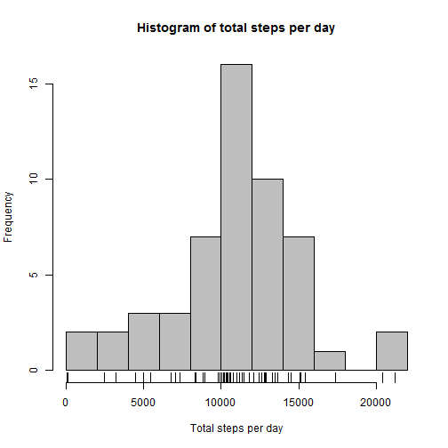
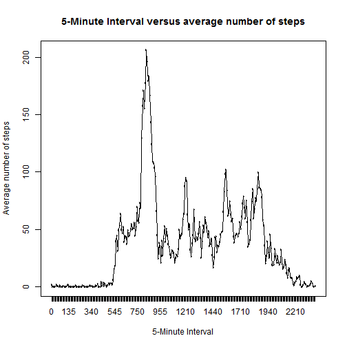
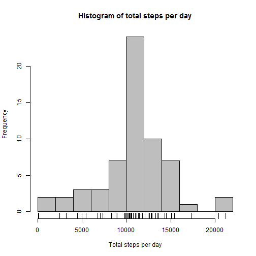
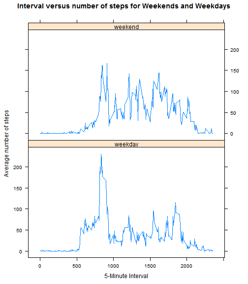

# Reproducible Research: Peer Assessment 1

This project makes use of data from a personal activity monitoring device. 
The citation for the data was not provided. A device was used to collect data at 5 minute intervals throughout the day. Time intervals are named according to a 24 hour clock:  ie 8:35 AM corresponds to interval "835" and interval "2355" corresponds to 11:55 PM.  The data consists of two months of data from an anonymous individual collected during the months of October and November 2012 and includes the number of steps taken in 5 minute intervals each day.

The purpose of this assignment is to practice generating a .Rmd report and use knitr to weave it to HTML for upload into GitHub.

## Section 1:  Loading and preprocessing the data 

1. Load the data
2. Process/transform the data (if necessary) into a format suitable for your analysis

**Section 1:1 Load the data**  
  
Unzip the data file if it is not already unzipped in the project folder.  

```r
if (!file.exists("activity.csv")) {
    unzip("activity.zip")
}
```

Load the activity data and assign classes to each of its 3 columns.

```r
activity.data <- read.csv("activity.csv", colClasses = c("numeric", "Date", 
    "numeric"))
dataset.length <- dim(activity.data)[1]
```

The above dataset possesses 17568 rows.
Here is its first 5 lines:

```r
activity.data[1:5, ]
```

```
##   steps       date interval
## 1    NA 2012-10-01        0
## 2    NA 2012-10-01        5
## 3    NA 2012-10-01       10
## 4    NA 2012-10-01       15
## 5    NA 2012-10-01       20
```

**Section 1:2 Process/transform the data**  
  
Sections 2 and 3 below require missing values in the dataset to be ignored.  Here I remove the NAs in a dataframe called data.rm.na to be used in Sections 2 and 3.


```r
data.rm.na <- activity.data[!(is.na(activity.data[, 1])), ]
data.rm.length <- dim(data.rm.na)[1]
total.days.noNA <- length(unique(data.rm.na$date))
total.days <- length(unique(activity.data$date))
```

The remaining dataset possesses 15264 rows.
53 of the 61 total days have measurements.
  
I use the scipen option command below to format the in-line numbers that are used in this report.

```r
options(scipen = 1, digits = 2)
```


## Section 2:  What is mean total number of steps taken per day? 
1.  Make a histogram of the total number of steps taken each day
2.	Calculate and report the mean and median total number of steps taken per day

**Section 2:1 Make a histogram of the total number of steps taken each day**  
  
First, calculate the total (sum) steps per day.

```r
step.sum.by.day <- tapply(data.rm.na$steps, data.rm.na$date, sum, simplify = TRUE)
```

Second, plot the histogram for the total steps per day.

```r
hist(step.sum.by.day, breaks = c(10), col = "grey", xlab = "Total steps per day", 
    main = "Histogram of total steps per day")
rug(step.sum.by.day)
```

 

**Section 2:2 Calculate and report the mean and median total number of steps taken per day**
  
Calculate the mean and median total number of steps taken per day. 

```r
mean.step.sum.by.day <- mean(step.sum.by.day)
median.step.sum.by.day <- median(step.sum.by.day)
```


The mean total steps per day was 10766.19.
The median total step per day was 10765.
  
## Section 3: What is the average daily activity pattern?
  
1. Make a time series plot (i.e. type = "l") of the 5-minute interval (x-axis) and the average number of steps taken, averaged across all days (y-axis)
2. Which 5-minute interval, on average across all the days in the dataset, contains the maximum number of steps?

**Section 3:1 Make a time series plot of the 5-minute interval and the average number of steps taken**
  
First, convert the interval variable to a factor with 288 levels and calculate the mean steps per interval.

```r
gl <- as.factor(activity.data$interval)
mean.steps.by.interval <- tapply(activity.data$steps, gl, mean, na.rm = T, simplify = T)
```


Second, make the time series plot of interval versus average number of steps.

```r
plot(unique(gl), mean.steps.by.interval, type = "n", xlab = "5-Minute Interval", 
    ylab = "Average number of steps", main = "5-Minute Interval versus average number of steps")
lines(unique(gl), mean.steps.by.interval)
```

 


**Section 3:2 Which 5-minute interval, averaged across all days, contains the maximum number of steps?**
  
Order the mean number of steps per interval and extract the first element to obtain the max number of steps.

```r
max.interval <- mean.steps.by.interval[order(mean.steps.by.interval, decreasing = T)][1]
max.name <- names(max.interval)
```


The interval containing the maximum average number of steps was interval 835 with 206.17 steps.

## Section 4:  Imputing missing values 
1. Calculate and report the total number of missing values in the dataset (i.e. the total number of rows with NAs)
2. Devise a strategy for filling in all of the missing values in the dataset. The strategy does not need to be sophisticated. For example, you could use the mean/median for that day, or the mean for that 5-minute interval, etc.
3. Create a new dataset that is equal to the original dataset but with the missing data filled in.
4. Make a histogram of the total number of steps taken each day and Calculate and report the mean and median total number of steps taken per day. Do these values differ from the estimates from the first part of the assignment? What is the impact of imputing missing data on the estimates of the total daily number of steps?


Because there are a number of days/intervals where there are missing values (coded as `NA`). The presence of missing days may introduce bias into some calculations or summaries of the data.

In this section I re-run the above calculations with imputed values.

**Section 4:1 Calculate and report the total number of missing values in the dataset**

Count the number of NAs.

```r
logic.na <- is.na(activity.data[, 1])
number.of.NA <- sum(logic.na)
```

The number of NAs is 2304.

**Section 4:2. Devise a strategy for filling in all of the missing values in the dataset** 

Below I use the mean for the 5-minute interval to replace the NA for each missing value.

**Section 4:3. Create a new dataset that is equal to the original dataset but with the missing data filled in**

The imputed values are stored in the activity.data.impute variable.

```r
activity.data.impute <- activity.data
for (i in 1:length(activity.data[, 1])) {
    if (is.na(activity.data$steps[i])) {
        interval <- as.character(activity.data$interval[i])
        activity.data.impute[i, 1] <- mean.steps.by.interval[interval]
    }
    
}
```


**Section 4:4a. Make a histogram of the total number of steps taken each day** 

Recalculate the average total steps per day using the imputed dataset and replot the histogram.

```r
step.sum.by.day <- tapply(activity.data.impute$steps, activity.data.impute$date, 
    sum, simplify = TRUE)
hist(step.sum.by.day, breaks = c(10), col = "grey", xlab = "Total steps per day", 
    main = "Histogram of total steps per day")
rug(step.sum.by.day)
```

 

**Section 4:4b Calculate and report the mean and median total number of steps taken per day**

Calculate the mean and median total number of steps taken per day with the imputed dataset.

```r
mean.step.sum.by.day <- mean(step.sum.by.day)
median.step.sum.by.day <- median(step.sum.by.day)
```


The mean total steps per day was 10766.19.
The median total steps per day was 10766.19.

**Section 4:4c  Do these values differ from the estimates from the first part of the assignment? What is the impact of imputing missing data on the estimates of the total daily number of steps?**

Because the imputed values use the average of each interval, the histogram of the imputed values is changed for values near the histogram's center.  The frequency of values near the mean is increased in the imputed dataset compared to the original dataset.  The overall mean of both datasets remained the same.  The median of the imputed dataset became the dataset's mean.


## Section 5: Are there differences in activity patterns between weekdays and weekends?   
  
1. Create a new factor variable in the dataset with two levels - "weekday" and "weekend" indicating whether a given date is a weekday or weekend day.
2. Make a panel plot containing a time series plot (i.e. type = "l") of the 5-minute interval (x-axis) and the average number of steps taken, averaged across all weekday days or weekend days (y-axis). 


**Section 5:1 Create a new factor variable in the dataset with levels "weekday" and "weekend"**

Using the dataset with imputed values, I create a factor variable named "PartOfWeek" to label each day as
either "weekday" or "weekend" and add the factor variable to the imputed dataset.

```r
PartOfWeek <- weekdays(activity.data.impute$date, abbreviate = T)
PartOfWeek <- gsub("Mon|Tue|Wed|Thu|Fri", "weekday", PartOfWeek)
PartOfWeek <- gsub("Sat|Sun", "weekend", PartOfWeek)
activity.data.impute.PartOfWeek <- cbind(activity.data.impute, PartOfWeek)
```


**Section 5:2. Make a panel plot containing a time series plot of the 5-minute interval and the average number of steps taken, averaged across all weekday days or weekend days** 

First, use data.table to subset and calculate the mean number of steps per interval by PartOfWeek.

```r
library(data.table)
x <- as.data.table(activity.data.impute.PartOfWeek)
mean.steps.by.PartOfWeek <- x[, mean(steps), by = "interval,PartOfWeek"]
```


Then, use a lattice plot to make a panel plot for 5-minute interval vs the average number of steps for both weekends and weekdays.


```r
library(lattice)
xyplot(V1 ~ interval | PartOfWeek, data = mean.steps.by.PartOfWeek, type = "l", 
    xlab = "5-Minute Interval", ylab = "Average number of steps", main = "Interval versus number of steps for Weekends and Weekdays")
```

 

  
*Last Modified June 15, 2014* 
